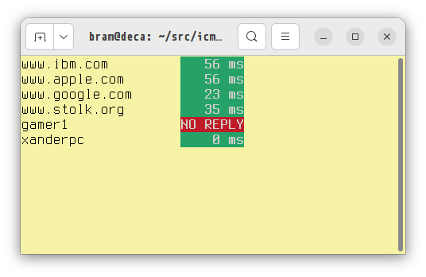

# icmp_watch
Send batch requests for ICMP and show results in a console window to monitor availability of hosts.

## Limitations

 * Uses ICMP sockets, which means that sysctl net.ipv4.ping_group_range needs to be set properly. (My Ubuntu 22.04 was configured correctly for this, by default.)

## Usage

`$ ./icmp_watch [option]... hostname...`

(Multiple hostnames can be specified.)

Valid options are:

* `-i` or `--interval`: specify how long in seconds to wait for replies (real numbers, e.g. 1.5 are allowed, default is 1 second)
* `-4` and `-6`: restrict to only using IPv4 or IPv6 respectively
* `-h` or `--help`: show help text

Press Q or ESC to stop monitoring.

## Function

This tool will batch test availability by sending out N ICMP-requests, and then wait up to 1 second for N replies.

Hosts that do not reply will be marked in RED, others in GREEN with the response time shown in milliseconds.

Efficiently implemented in C, zero polling, two sockets for all N hosts (one for all IPv4 connections, one for all IPv6 connections).

## Features

 * Super lightweight: uses 0.0% CPU/MEM on my machine.
 * Single file C source.
 * MIT license.

## Troubleshoot

If the tool fails on permissions when creating the socket, please do:

`$ sysctl -w net.ipv4.ping_group_range="0 2147483647"` to allow users to create ICMP sockets. You can use "0 0" range if you want this for root only.

## Author

The icmp_watch tool is made by Abraham Stolk.

